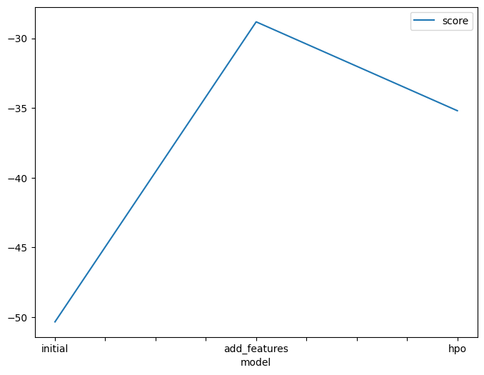

# Report: Predict Bike Sharing Demand with AutoGluon Solution
#### Ahmed Saed

## Initial Training
### What did you realize when you tried to submit your predictions? What changes were needed to the output of the predictor to submit your results?
Some of the predictions were negative, so I had to change the output to be non-negative.

### What was the top ranked model that performed?
WeightedEnsemble_L3

## Exploratory data analysis and feature creation
### What did the exploratory analysis find and how did you add additional features?
From inspecting the data, I found out that some features were binary like `holiday` and `workingday`,
some features were categorical like `season` and `weather`. I added the hour feature since it might help the model to get an intuition about the demand at different times of the day.

### How much better did your model preform after adding additional features and why do you think that is?
The score before adding the features was 1.79546, and after adding the features it became 0.84348. I think the model performed better because it had more information to learn from.

## Hyper parameter tuning
### How much better did your model preform after trying different hyper parameters?
The score before tuning was 0.84348, and after tuning it became 0.46882. The model performed better after tuning.

### If you were given more time with this dataset, where do you think you would spend more time?
I would spend more time on feature engineering, and trying out different models.

### Create a table with the models you ran, the hyperparameters modified, and the kaggle score.
|    | model        | hpo1                                                                                                                                                                                   | hpo2                                                                                                                              | hpo3                                                                                                                                                                                 |   score |
|---:|:-------------|:---------------------------------------------------------------------------------------------------------------------------------------------------------------------------------------|:----------------------------------------------------------------------------------------------------------------------------------|:-------------------------------------------------------------------------------------------------------------------------------------------------------------------------------------|--------:|
|  0 | initial      | defualt                                                                                                                                                                                | defualt                                                                                                                           | defualt                                                                                                                                                                              | 1.79546 |
|  1 | add_features | defualt                                                                                                                                                                                | defualt                                                                                                                           | defualt                                                                                                                                                                              | 0.84348 |
|  2 | hpo          | {'num_boost_round' : ag.space.Int(lower=100 upper=500, default=100), 'num_leaves' : ag.space.Int(lower=6, upper=10), 'learning_rate' : ag.space.Real(lower=0.01, upper=0.3, log=True)} | {'iterations' : 200, 'learning_rate' : ag.space.Real(lower=0.01, upper=0.3, log=True), 'depth' : ag.space.Int(lower=6, upper=10)} | {'n_estimators' : ag.space.Int(lower=100, upper=500, default=100), 'max_depth' : ag.space.Int(lower=6, upper=10, default=6), 'eta' : ag.space.Real(lower=0.01, upper=0.3, log=True)} | 0.46882 |

### Create a line plot showing the top model score for the three (or more) training runs during the project.

### Create a line plot showing the top kaggle score for the three (or more) prediction submissions during the project.

## Summary
The model performed better after adding features and tuning the hyperparameters. The model could be improved by trying out different models, and doing more feature engineering.
